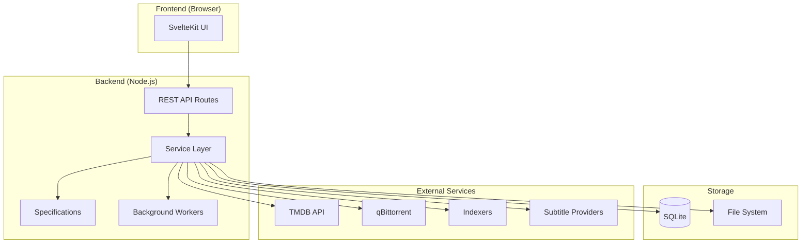
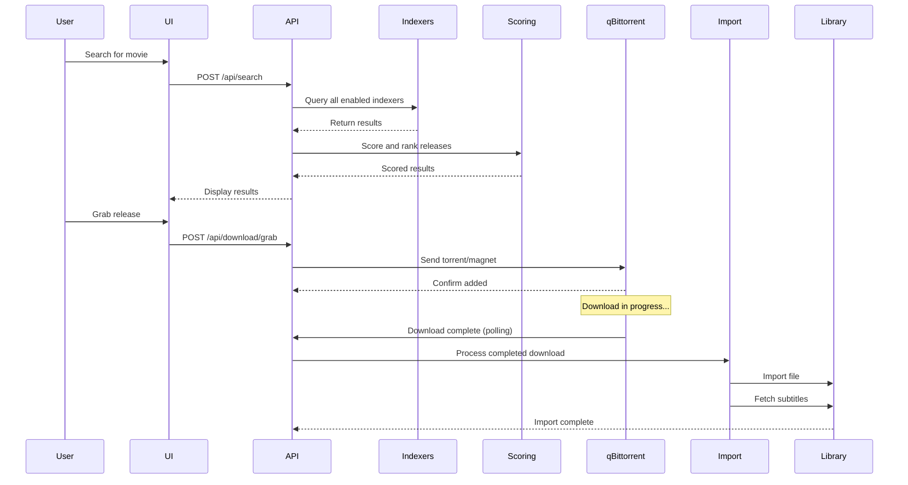
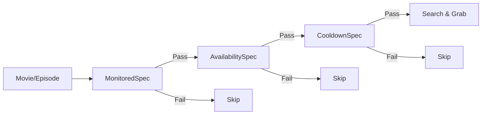
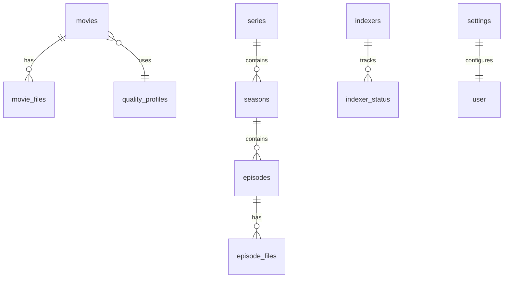

[< Back to Index](../INDEX.md) | [Contributing](contributing.md) | [Monitoring Internals](monitoring-internals.md)

# Architecture Overview

This document provides a technical overview of Cinephage's architecture for developers and contributors.

---

## System Architecture



---

## Directory Structure

```
src/
├── routes/                    # SvelteKit pages and API endpoints
│   ├── api/                   # REST API routes (88+ endpoints)
│   └── ...                    # Page routes
├── lib/
│   ├── components/            # Reusable Svelte 5 components
│   ├── server/                # Server-side business logic
│   │   ├── db/                # Database schema and initialization
│   │   ├── downloadClients/   # qBittorrent/SABnzbd integration
│   │   ├── indexers/          # YAML-based Cardigann engine
│   │   ├── library/           # File watching, scanning, naming
│   │   ├── monitoring/        # Specification pattern scheduler
│   │   ├── quality/           # Quality filtering
│   │   ├── scoring/           # Release scoring engine
│   │   ├── subtitles/         # Subtitle providers
│   │   ├── streaming/         # Stream resolution
│   │   ├── tasks/             # Task history and scheduling
│   │   └── workers/           # Background worker management
│   ├── types/                 # TypeScript type definitions
│   ├── utils/                 # Shared utility functions
│   └── stores/                # Svelte stores
├── test/                      # Test utilities
data/
├── indexers/                  # Cardigann YAML definitions
drizzle/                       # Database migrations
```

---

## Download Flow



---

## Server Initialization

The server initializes services in a staggered sequence to manage resources:

```mermaid
gantt
    title Server Startup Sequence
    dateFormat X
    axisFormat %ss

    section Blocking
    Database Migrations           :0, 1

    section Immediate (0ms)
    Library Scheduler            :1, 2
    Download Monitor             :1, 2

    section Delayed (5s)
    Monitoring Scheduler         :5, 6
    External ID Service          :5, 6

    section Delayed (10s)
    Browser Solver               :10, 11
```



This staggered initialization is defined in `hooks.server.ts`:

1. **Database migrations** (blocking) - Must complete before anything else
2. **Library scheduler + Download monitor** (immediate) - Core functionality
3. **Monitoring scheduler + External ID service** (5s delay) - Background tasks
4. **Browser solver** (10s delay) - Resource-intensive Cloudflare handling

---

## Key Patterns

### Singleton Services

Core services use the singleton pattern, initialized once in `hooks.server.ts`:

- `downloadMonitor` - Polls download clients for status
- `importService` - Handles file imports
- `monitoringScheduler` - Runs automated tasks
- `librarySchedulerService` - File watching and scanning

### Service Manager (Lazy Initialization)

Heavy services use lazy initialization via getters:

```typescript
// src/lib/server/services/serviceManager.ts
let externalIdService: ExternalIdService | null = null;

export function getExternalIdService() {
	if (!externalIdService) {
		externalIdService = new ExternalIdService(db);
	}
	return externalIdService;
}
```

This pattern is used for:

- `getRootFolderService()`
- `getDownloadClientManager()`
- `getExternalIdService()`
- `getBrowserSolver()`

### Specification Pattern

The monitoring system uses the Specification Pattern for decision-making:



Specifications include:

- `MovieMonitoredSpecification`
- `EpisodeMonitoredSpecification`
- `MissingContentSpecification`
- `CutoffUnmetSpecification`
- `UpgradeableSpecification`
- `NewEpisodeSpecification`

See [Monitoring Internals](monitoring-internals.md) for details.

---

## Database

### Technology

- **SQLite** with better-sqlite3 (synchronous driver)
- **Drizzle ORM** for type-safe queries
- Schema defined in `src/lib/server/db/schema.ts`

### Key Tables



### Why SQLite?

- Single-file database, easy to backup
- No separate database server needed
- Synchronous driver works well with background services
- Sufficient for single-user/small-team use case

---

## Indexer System

The indexer system uses YAML-based Cardigann definitions:

```
data/indexers/definitions/
├── bitsearch.yaml
├── eztv.yaml
├── knaben.yaml
├── yts.yaml
├── scenetime.yaml
└── oldtoonsworld.yaml
```

### Indexer Flow

1. **Definition loaded** from YAML on startup
2. **Search request** built using template variables
3. **Response parsed** using selectors
4. **Results normalized** to common format
5. **Deduplication** by info hash across indexers

### Supported Protocols

- `torrent` - Standard torrent indexers
- `usenet` - Newznab-compatible indexers
- `streaming` - Streaming providers

---

## Scoring Engine

Releases are scored using 100+ format attributes:

```typescript
// Simplified scoring flow
const score =
	getResolutionScore(release) + // 0-20000
	getAudioScore(release) + // 0-2000
	getHDRScore(release) + // 0-1000
	getReleaseGroupScore(release) + // 0-500
	getPenalties(release); // negative values
```

The scoring database from [Dictionarry](https://github.com/Dictionarry-Hub/database) provides format definitions.

---

## Background Workers

Workers handle concurrent operations with configurable limits:

| Worker Type | Default Max | Purpose            |
| ----------- | ----------- | ------------------ |
| Streams     | 10          | Stream resolution  |
| Imports     | 5           | File imports       |
| Scans       | 2           | Library scans      |
| Monitoring  | 5           | Automated searches |

Configure via environment variables:

```
WORKER_MAX_STREAMS=10
WORKER_MAX_IMPORTS=5
WORKER_MAX_SCANS=2
WORKER_MAX_MONITORING=5
```

---

## API Structure

API routes follow RESTful patterns under `/api/`:

| Category   | Routes | Purpose                   |
| ---------- | ------ | ------------------------- |
| Discovery  | 3      | TMDB search/browse        |
| Library    | 14     | Movies, series, episodes  |
| Search     | 1      | Multi-indexer search      |
| Indexers   | 5      | Indexer configuration     |
| Queue      | 6      | Download queue management |
| Subtitles  | 15     | Subtitle operations       |
| Monitoring | 8      | Automated tasks           |
| Streaming  | 8      | Stream resolution         |

See [API Reference](../reference/api.md) for endpoint documentation.

---

## Frontend Architecture

### Svelte 5 Runes

The frontend uses Svelte 5's runes system:

```svelte
<script lang="ts">
	// Props
	let { data } = $props();

	// Reactive state
	let value = $state('');

	// Computed/derived
	const computed = $derived(value.length);

	// Side effects
	$effect(() => {
		console.log('Value changed:', value);
	});
</script>
```

### Component Organization

Components are organized by feature:

- `/lib/components/discover/` - Discovery UI
- `/lib/components/library/` - Library management
- `/lib/components/search/` - Search interface
- `/lib/components/ui/` - Reusable primitives

---

**See also:** [Contributing](contributing.md) | [Monitoring Internals](monitoring-internals.md) | [Testing](testing.md)
