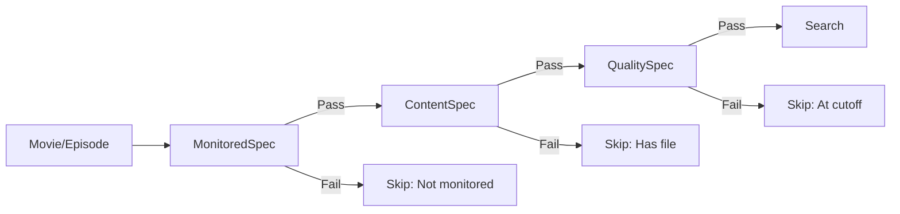
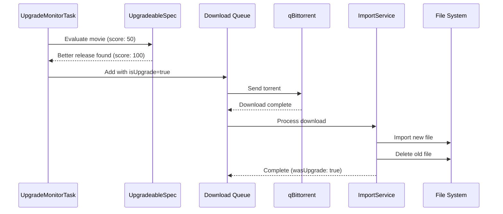

[< Back to Index](../INDEX.md) | [Architecture](architecture.md) | [Testing](testing.md)

# Monitoring System Internals

This document covers the internal architecture of Cinephage's automated monitoring system.

---

## Overview

Cinephage implements a Radarr/Sonarr-style monitoring system that automatically searches for and downloads media based on quality profiles and monitoring settings.

---

## Multi-Level TV Monitoring

TV shows use a **cascading monitoring** system with three levels:

### Monitoring Levels

1. **Series Level** (`series.monitored`)
   - Top-level monitoring flag for the entire series
   - When disabled, **no episodes** in the series will be searched/downloaded

2. **Season Level** (`seasons.monitored`)
   - Per-season monitoring flag
   - When disabled, **no episodes in that season** will be searched/downloaded
   - Even if series is monitored

3. **Episode Level** (`episodes.monitored`)
   - Per-episode monitoring flag
   - When disabled, that **specific episode** won't be searched/downloaded
   - Even if both series and season are monitored

### Cascading Logic

An episode is **only monitored** if **ALL THREE** levels are enabled:

```typescript
// From EpisodeMonitoredSpecification
isMonitored = series.monitored AND season.monitored AND episode.monitored
```

**Example 1:**

- Series "Breaking Bad" is monitored
- Season 1 is monitored
- Episode S01E01 is monitored
- **Result:** S01E01 will be searched

**Example 2:**

- Series "Breaking Bad" is monitored
- Season 1 is NOT monitored
- Episode S01E01 is monitored
- **Result:** S01E01 will NOT be searched (season blocks it)

**Example 3:**

- Series "Breaking Bad" is NOT monitored
- Season 1 is monitored
- Episode S01E01 is monitored
- **Result:** S01E01 will NOT be searched (series blocks it)

---

## Movie Monitoring

Movies use a simpler single-level system:

- **Movie Level** (`movies.monitored`)
  - When enabled, movie will be searched/downloaded

---

## Monitoring Tasks

The system runs automated tasks on configurable schedules:

| Task              | Default Interval | Purpose                      |
| ----------------- | ---------------- | ---------------------------- |
| Missing Content   | 24 hours         | Find content without files   |
| Upgrade Monitor   | Weekly           | Find better quality releases |
| New Episode Check | 1 hour           | Search newly aired episodes  |
| Cutoff Unmet      | 24 hours         | Find content below cutoff    |

### Missing Content Search

- **Purpose:** Find and download content that doesn't have files yet
- **Targets:** Movies/episodes with `monitored=true` and `hasFile=false`
- **Specification:** `MissingContentSpecification`

### Upgrade Monitor

- **Purpose:** Find better quality releases for existing files
- **Targets:** Movies/episodes with files scoring below `upgradeUntilScore`
- **Specifications:** `CutoffUnmetSpecification`, `UpgradeableSpecification`

### New Episode Check

- **Purpose:** Search for newly aired episodes
- **Targets:** Episodes that aired within the last N hours
- **Specification:** `NewEpisodeSpecification`

### Cutoff Unmet Search

- **Purpose:** Find content below quality cutoff
- **Targets:** Movies/episodes with files scoring below `upgradeUntilScore`
- **Specification:** `CutoffUnmetSpecification`

---

## Specification Pattern

The monitoring system uses the **Specification Pattern** for decision-making:



### Monitoring Specifications

#### MovieMonitoredSpecification

```typescript
Accept if: movie.monitored === true
Reject if: movie.monitored === false
```

#### EpisodeMonitoredSpecification (Cascading)

```typescript
Accept if: series.monitored AND season.monitored AND episode.monitored
Reject if: any level is false (with specific reason)
```

### Content Specifications

#### MissingContentSpecification

```typescript
Accept if: no existing file (hasFile === false)
Reject if: file already exists
```

#### NewEpisodeSpecification

```typescript
Accept if: episode.airDate within last N hours
Reject if: not aired yet OR aired too long ago
```

### Upgrade Specifications

#### CutoffUnmetSpecification

```typescript
Accept if:
  - upgrades allowed in profile
  - upgradeUntilScore > 0 (cutoff defined)
  - existing file score < upgradeUntilScore
Reject if:
  - no existing file
  - upgrades not allowed
  - no cutoff defined
  - already at cutoff
```

#### UpgradeableSpecification

```typescript
Accept if:
  - upgrades allowed
  - new release scores higher than existing
  - improvement >= minScoreIncrement
  - new score < upgradeUntilScore (or no cutoff)
Reject if:
  - quality not better
  - improvement too small
  - already at cutoff
```

---

## Auto-Replace Flow

When the monitoring system finds a better quality release:



1. **Search:** UpgradeMonitorTask finds movie/episode below cutoff
2. **Evaluate:** UpgradeableSpecification validates release is better
3. **Grab:** Release added to download queue with `isUpgrade=true` flag
4. **Download:** Download client completes download
5. **Import:** ImportService detects upgrade flag:
   - Creates new file record
   - Deletes old file (both database record and physical file)
   - Updates `hasFile` to remain true (seamless replacement)
6. **History:** Full audit trail recorded in `monitoringHistory`

---

## API Endpoints

### Series Monitoring

```http
PATCH /api/library/series/{id}
Body: { "monitored": true/false }
```

### Season Monitoring

```http
PATCH /api/library/seasons/{id}
Body: {
  "monitored": true/false,
  "updateEpisodes": true  // Optional: also update all episodes
}
```

### Episode Monitoring

```http
PATCH /api/library/episodes/{id}
Body: { "monitored": true/false }
```

### Batch Episode Monitoring

```http
PATCH /api/library/episodes/batch
Body: {
  "episodeIds": ["id1", "id2"],
  "monitored": true/false
}
```

Or by series/season:

```http
PATCH /api/library/episodes/batch
Body: {
  "seriesId": "series-id",
  "seasonNumber": 1,
  "monitored": true/false
}
```

### Manual Task Triggers

```http
POST /api/monitoring/search/missing
POST /api/monitoring/search/upgrade
POST /api/monitoring/search/new-episodes
POST /api/monitoring/search/cutoff-unmet
```

---

## Settings

Monitoring settings stored in `monitoring_settings` table:

| Setting                              | Default | Description                      |
| ------------------------------------ | ------- | -------------------------------- |
| `enabled`                            | true    | Master on/off switch             |
| `missing_search_interval_hours`      | 24      | Missing content search interval  |
| `upgrade_search_interval_hours`      | 168     | Upgrade search interval          |
| `new_episode_check_interval_hours`   | 1       | New episode check interval       |
| `cutoff_unmet_search_interval_hours` | 24      | Cutoff unmet search interval     |
| `auto_replace_enabled`               | true    | Auto-replace with better quality |
| `search_on_monitor_enabled`          | true    | Search when item first monitored |

---

## History Tracking

All monitoring activity is tracked in `monitoring_history` table:

```typescript
{
  taskType: 'missing' | 'upgrade' | 'new_episode' | 'cutoff_unmet',
  movieId?: string,
  seriesId?: string,
  seasonNumber?: number,
  episodeId?: string,
  status: 'grabbed' | 'found' | 'no_results' | 'error',
  releasesFound: number,
  releaseGrabbed?: string,
  queueItemId?: string,
  isUpgrade: boolean,
  oldScore?: number,
  newScore?: number,
  executedAt: timestamp,
  errorMessage?: string
}
```

This provides full audit trail of:

- When monitoring tasks ran
- What was searched
- What was found/grabbed
- Upgrade details (scores before/after)
- Errors encountered

---

## Implementation Status

- Phase 1: Foundation & Schema
- Phase 2: Specifications & Decision Engine
- Phase 3: Search Orchestration
- Phase 4: Task Executors
- Phase 5: Auto-Replace & Import
- Phase 6: Multi-Level TV Monitoring API
- Phase 7: Scheduler Integration (mostly complete)
- Phase 8: Testing & Polish (ongoing)

---

**See also:** [Architecture](architecture.md) | [Testing](testing.md) | [Monitoring Guide](../guides/monitoring.md)
